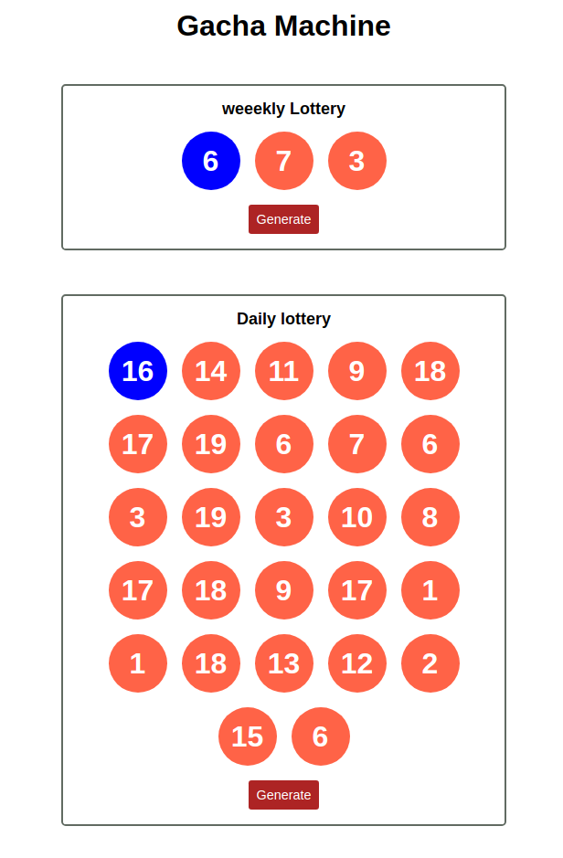

# React-gache-machine
Gacha machine prototype 

## How to install

- Make sure git is installed, [see how to install git](https://www.google.com/search?q=how+to+isntall+git&oq=how+to+isntall+git&aqs=chrome..69i57j0i10l9.4306j0j7&sourceid=chrome&ie=UTF-8). 
- open your terminal or cmd 
- copy this text to terminal "git clone https://github.com/MohammadFarhan7534031b/react-gacha-machine.git gacha-machine"
- copy this text to terminal "cd gacha-machine"
- copy this text to terminal "npm build"
- it will make new directory, call dist
- open that folder
- open file with name index.html 

## Galery

